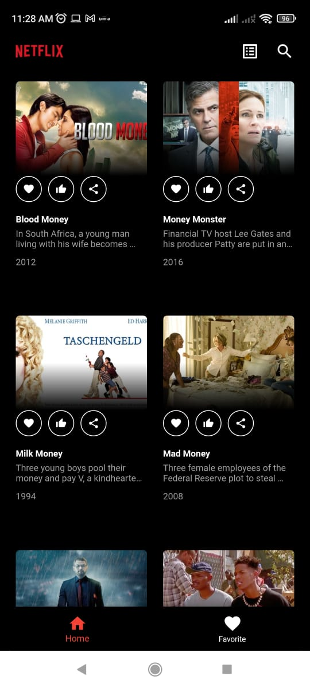
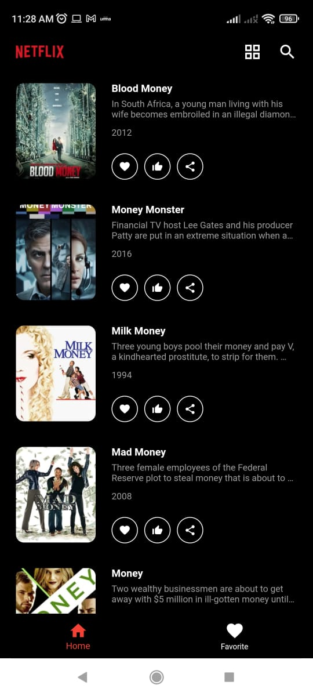
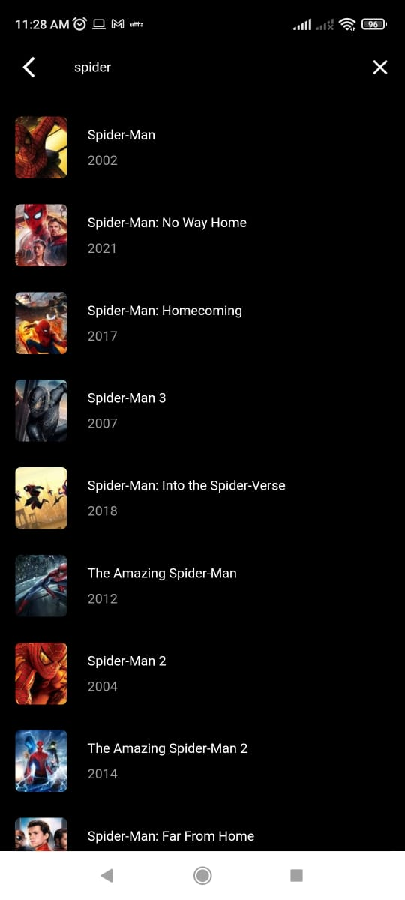
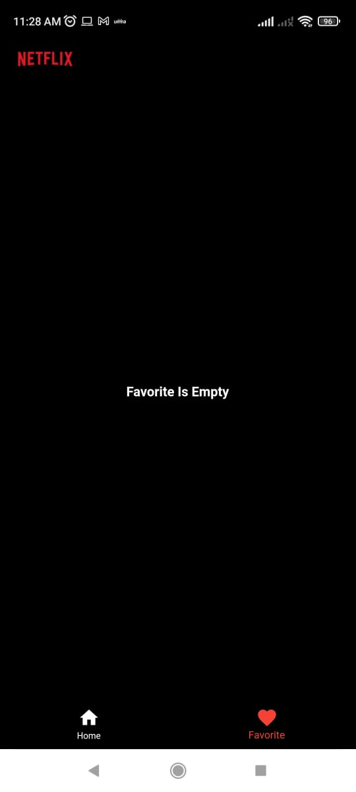
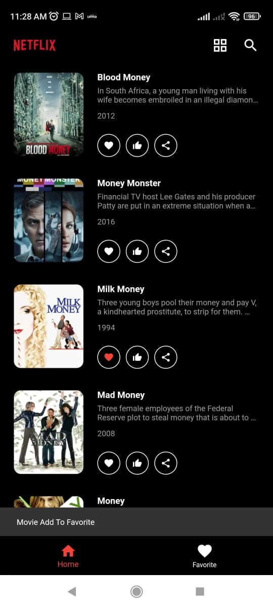
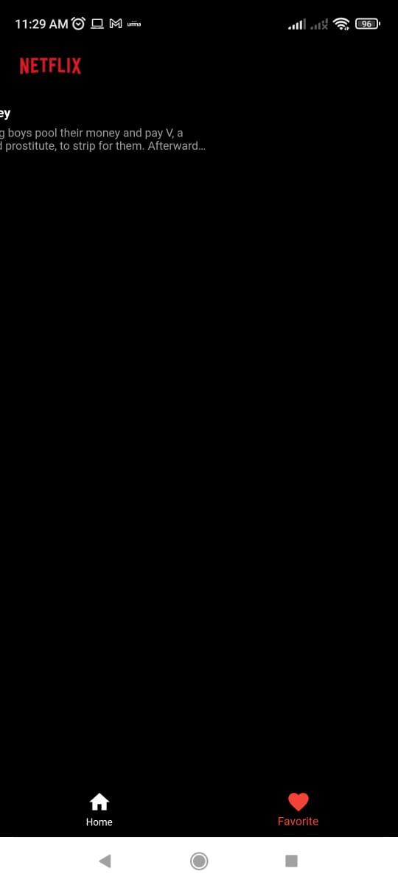

# Sribuu Home Task - Movie App

Ini merupakan repository yang ditujukan untuk memenuhi persyaratan Front-End Developer di Sribuu.

Dimana pada aplikasi ini menggunakan Bloc State Management dan menggunakan Moor sebagai local database.

Link buat APK : [gdrive.link](https://drive.google.com/drive/folders/1wFXfQCRfc9yUS7K8j5g_xSfm7iXqw7iU?usp=sharing "Google Drive for APK")

## Screenshot

  
  
  
  
  
  

